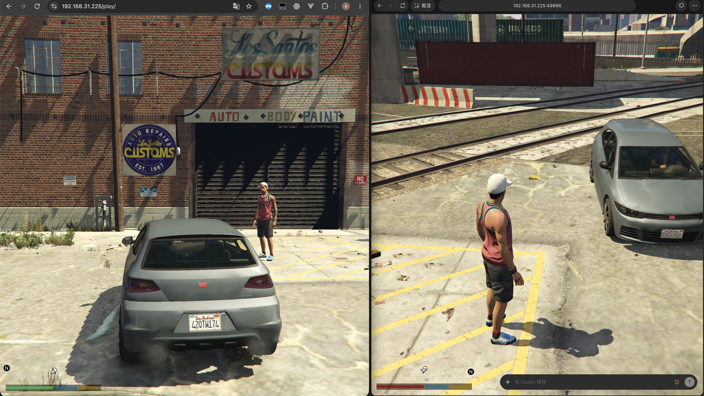
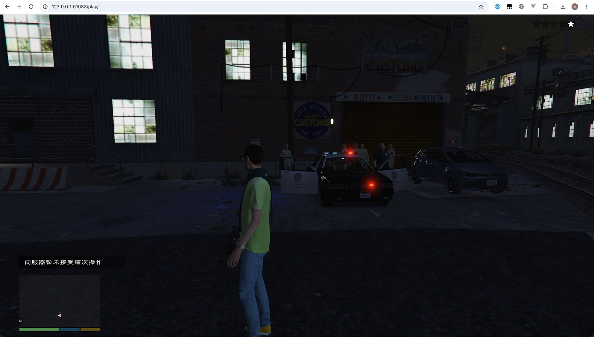
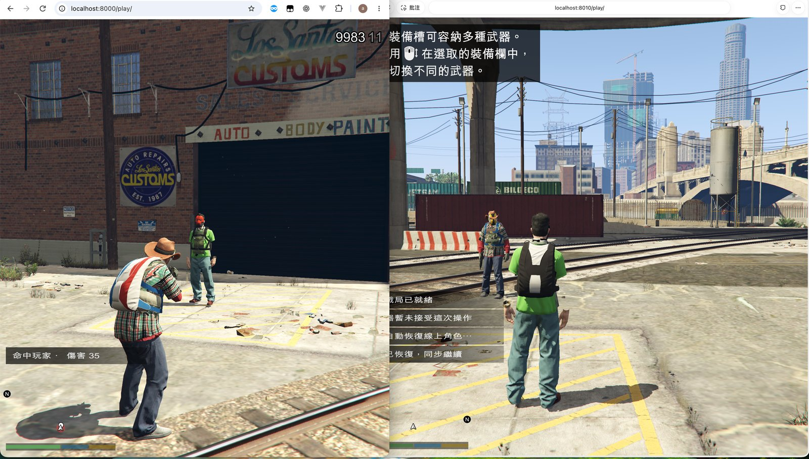
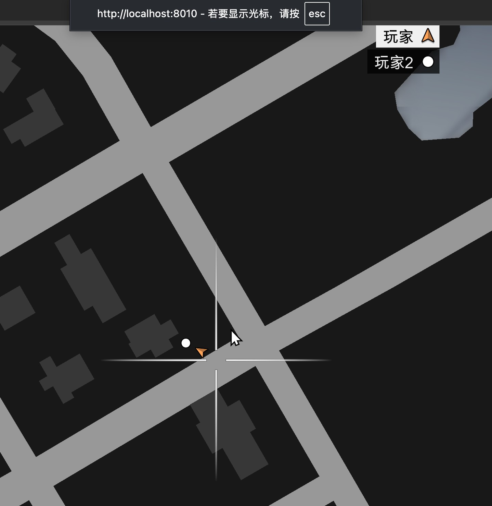
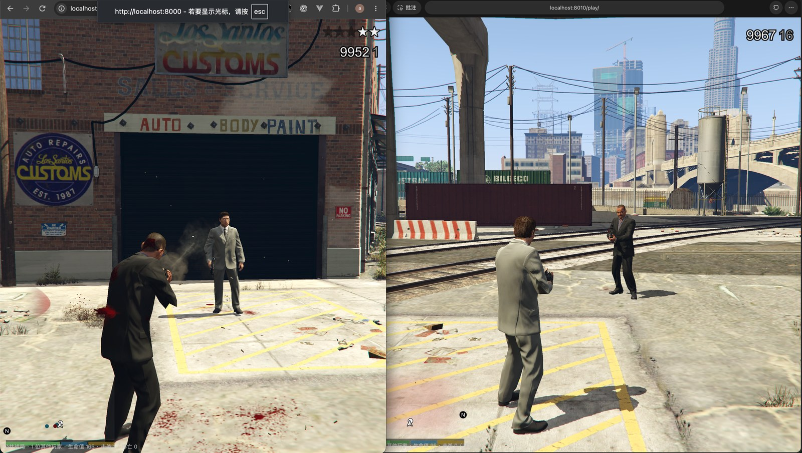
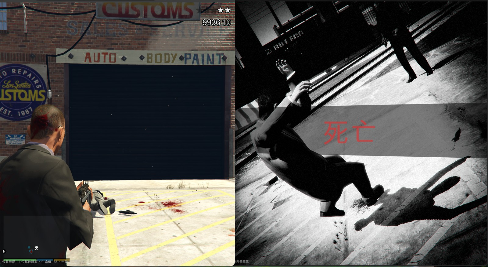

# GTAV Web Multiplayer Launcher

[English](README.md) | [简体中文](README.zh-CN.md)

A desktop launcher, browser client bridge, and experimental Java shared-world server for a supported GTAV browser engine. The launcher reads the player's own resources and runs the game in a WebGPU browser.

**[Website](https://gtav.2t.hk/) · [GitHub repository](https://github.com/AliYa-chen/gtav-web-multiplayer-launcher)**

The repository contains project source and documentation. **It does not provide the game, the original browser engine, RPF archives, maps, textures, fonts, or other proprietary game assets.** A regular PC GTA V installation is not a replacement for the supported browser-engine resource layout.

## Current scope

- Tauri 2 launcher for Windows x64 and macOS Apple Silicon; game rendering runs in the default browser.
- Story, sandbox, and public-session launch modes; English, Simplified Chinese, and system language selection.
- Read-only resource discovery and version checks, isolated engine/font caches, and local or LAN HTTPS resource serving.
- Public-session endpoints, names, announcements, and download metadata come from the [configuration API](https://oss.2t.hk/gtav/). Public server addresses are not compiled into the client.
- A standalone Java 17+ server owns player/entity identity, seats, ownership leases, combat decisions, respawning, population, weather, and law rules. Authorized client engines execute assigned native movement and vehicle simulation.

**Launcher 0.2.16; server source 0.4.4-world-experimental.** This server update adds confirmed NPC line of sight, last-known-position pursuit, and shared police sightings. It uses the existing 0.2.16 client and does not rebuild the launcher or modify game resources. The workflow publishes and deploys the US routes; China remains a separately requested local deployment. Check the Actions audit for the actual running version. See [NPC perception](docs/npc-perception.md) and [automated releases](docs/releases.md).

Multiplayer remains experimental. Static collision and pedestrian navigation cover roughly **600 × 600 metres around the test spawn**, not the whole map. There is no complete server-side RAGE physics runtime or migration of every single-player script, tool, mission, or vehicle weapon. This uses a custom protocol and does not implement native GTA Online or FiveM compatibility. Protocol tests do not establish complete gameplay synchronization; `game_sync` and `native_clone_transport` remain false.

## Phased roadmap

✅ means the stated scope is implemented; ❌ means it remains unfinished. Completed foundations do not imply that every weapon, vehicle, or area is supported.

| Phase | Status | Scope |
| --- | --- | --- |
| Foundation | ✅ | Shared player/entity identities, snapshots, reconnect recovery, and ownership leases. |
| Foundation | ✅ | Basic player-versus-player gun, melee, and projectile damage, death, and respawning. |
| Foundation | ✅ | Shared time, weather, and basic wanted/police rules. |
| Foundation | ✅ | Local pedestrian population, AI movement, static collision, and navigation around the spawn area (about 600 × 600 m). |
| Foundation | ✅ | Shared vehicle seats and passenger/ownership reconciliation in client 0.2.15. |
| Foundation | ✅ | Windows/macOS release packages, public source, MIT License, and bilingual development/integration guides. |
| P0 — urgent stability | ✅ | Remove the identified fullscreen-glow crash path for synchronized rockets/grenades in 0.2.16; use bounded ordinary model markers and avoid native explosion replay. [Fix details](docs/explosive-rendering.md). |
| P0 — entry experience | ❌ | Cloud-style loading, verified camera descent, real snapshot/avatar/scene readiness, retry/cancel and control restoration. |
| Research foundation | ✅ | REA/static inventory and 22 YSC structures verified; script behavior/runtime compatibility remains unproven. [Evidence](docs/rea-online-feasibility.md). |
| P1 — AI and world coverage | ✅ | Gate NPC combat on confirmed line of sight, pursue remembered positions, and share sightings within the same police response; shared sightings do not authorize shooting. [Scope and limits](docs/npc-perception.md). |
| P1 — AI and world coverage | ❌ | Complete NPC weapon behavior, field of view, cover selection, and tactical coordination. |
| P1 — AI and world coverage | ❌ | Expand collision/navigation coverage and police dispatch beyond the current local area toward the full map. |
| P2 — vehicles and equipment | ❌ | Synchronize vehicle damage and destruction from bullets and explosions. |
| P2 — vehicles and equipment | ❌ | Add server-owned inventory, weapon/item pickups, ammunition consumption, and armor. |
| P3 — tools and special weapons | ❌ | Implement fuel trails, fire extinguishers, fire propagation, night vision, and stun effects. |
| P3 — tools and special weapons | ❌ | Support sticky bombs on moving vehicles, mounted vehicle weapons, and their permissions. |
| P4 — public interactions and events | ❌ | Add shared item use, scene occupancy, and common interaction rules. |
| P4 — common free-mode lifecycle | ❌ | Session entry/exit, character/world readiness and shared event lifetime; inspect `freemode` as a dependency reference, not an executable Java script. |
| P4 — cooperative mission framework | ❌ | Original server task definitions, instance membership, objective revisions, deadlines, late join and phase recovery; `fm_mission_controller` is an audited candidate. |
| P4 — racing | ❌ | Countdown, ordered checkpoints, swept crossing, lap/finish validation and rankings; `fm_race_controler` resources guide further native investigation. |
| P4 — taxi and delivery | ❌ | Passenger pickup/dropoff, cargo entitlement, assignment/vehicle binding, deadlines and unique payout; candidates include `fm_content_taxi_driver` and `gb_delivery`. |
| P4 — escort and survival | ❌ | Shared protectee/waves, spawn budgets, owner handover, shared failure and bounded cleanup. |
| P4 — emergency incidents | ❌ | Shared police, ambulance and fire incidents; arrest, rescue/revival and fire-state rules remain separate work. |
| P4 — staged interiors and heists | ❌ | Original staged objectives, props/doors/interior readiness, scene synchronization and recovery; heist-script names do not prove complete compatible assets. |
| P5 — identity and inventory | ❌ | Accounts, permanent characters, one active character session, item/ammunition ownership and restart recovery. |
| P5 — garages and progression | ❌ | Durable vehicle assets, store/retrieve/repair conditions, shops and later businesses. |
| P5 — settlement | ❌ | PostgreSQL transaction ledger, unique reward entitlement, atomic inventory/balance changes and replay-safe outbox. |
| Operations and capacity | ❌ | Container deployment, Redis presence/matching, backup recovery, independent sessions and measured scaling. |
| Release maintenance | ✅ | Provide a locally built, ad hoc signed macOS development package. |
| Release maintenance | ❌ | Add macOS Developer ID signing and notarization. |

Implementation order: **stability → cloud-style entry and world readiness → AI/physics plus minimal persistent identity → equipment/vehicles → cooperative activities → persistent progression and multiple sessions**. The P0–P5 labels remain feature groups; the minimum P5 identity and durable settlement work starts before rewards and purchases. Signing can proceed separately. See the [detailed online-mode roadmap](docs/online-mode-roadmap.md) and [feature maintenance guide](docs/multiplayer-development.md).

## Toward an Online-style shared world

The goal is a self-hosted experience with cloud-style loading, character entry, shared free roam, cooperative jobs, garages and persistent progression. It is a staged reconstruction using the supported resources and project-owned rules. Compatibility with Rockstar services, original GTA Online scripts or the full official feature set has not been established.

A new [REA/resource audit](docs/rea-online-feasibility.md) parsed four shipped JavaScript files, 1,528 top-level RPF directories and 22 representative YSC structures. The mounted script package contains 1,026 YSC entries, including free-mode, race, taxi and delivery candidates; names and valid structures do not mean those modes run in this server. Original socket gaps remain, and REA does not directly support this WASM format; the native findings use the project's version-checked static parser.

Current limits remain eight players per process, 256 world entities and approximately 600 × 600 m of exported pedestrian navigation/collision. Containers and Redis do not supply missing RAGE physics or native synchronization. Permanent identity and idempotent reward transactions must precede meaningful progression; increasing the player limit requires measured load tests. See [phases, proposed modules and acceptance criteria](docs/online-mode-roadmap.md).

## How multiplayer works

The original game WASM is player-provided. This project creates an isolated adapted runtime, connects it to a project-owned JavaScript synchronization bridge, and uses a Java server to decide shared world state and rules. Python scripts audit/build the adaptation; packaged clients reproduce it in Rust without a Python dependency. Ordinary feature development mostly changes JavaScript and Java; new engine-facing capabilities require additional native-interface analysis.

See [architecture, builds, and maintenance](docs/multiplayer-development.md) or [website integration](docs/website-integration.md) for the implementation and extension workflow.

## Gameplay screenshots

These screenshots record earlier gameplay demonstrations. Game content remains subject to its owners' terms; see [NOTICE.md](NOTICE.md).



*Vehicle and nearby players rendered in two browser clients.*



*Police presence and wanted-level indicators during the earlier demonstration.*

<details>
<summary>More gameplay screenshots</summary>



*Player combat viewed from two clients.*



*Player markers on the in-game map.*



*Hit feedback during a player firefight.*



*The same combat scene and a player's death screen.*

</details>

## Quick start

### Desktop application

1. Visit the [website](https://gtav.2t.hk/) for the available client build and current server status.
2. Open the Windows EXE or macOS App and select your own supported browser-game resource folder.
3. Choose story, sandbox, or a public session. For public sessions, choose an available line and provide a nickname and character preset.
4. Start the game in a recent Chrome or Edge with WebGPU, WebAssembly threads, and shared-memory support.

The packaged launcher does not require Python, Java, Node.js, or Rust. Windows needs WebView2. Current macOS builds use development/ad hoc signing and are not notarized. See the [desktop guide](desktop/README.md) for resource discovery, LAN sharing, certificate trust, and platform requirements.

### Run from source

Install Python 3.11+. Prepare a supported resource root outside the repository, containing:

```text
/path/to/browser-game/
├── b/8b0b5899ed/game.wasm
├── b/8b0b5899ed/game.js
├── b/8b0b5899ed/io_worker.js
├── b/8b0b5899ed/wgpu_worker.js
└── data/manifest.json          # and the matching game data
```

From the repository root:

```sh
python3 -B tools/build_multiplayer_client.py --game-dir "/path/to/browser-game"
python3 -B serve_local.py --game-dir "/path/to/browser-game" --host 127.0.0.1 --open
```

The first command creates launcher-managed offline and online runtime copies in `client/runtime/`. It checks the original engine SHA-256 and rejects incompatible versions. It does not modify the resource directory. The offline copy matches the original bytes. See [resource isolation](docs/启动器资源隔离.md) for the supported hash and external runtime paths.

Keep the terminal open while playing. Use `Ctrl+C` to stop. Do not open the HTML through `file://`; the local server supplies the required isolation headers and range requests. On Windows, use an installed Python 3.11+ (`python` or `py -3`) or see the optional launch scripts; a Python runtime is not included in a source checkout.

### Build and run a local shared-world server

Install a JDK 17+ and Python 3.11+. The server has no Maven, database, third-party Java library, or game-engine runtime dependency:

```sh
python3 -B tools/build_multiplayer_server.py
java -jar server/multiplayer-server.jar --host 127.0.0.1 --port 8787
```

Check `http://127.0.0.1:8787/health`. A separately installed `server/world-data/` can provide local collision/navigation data; the source repository does not ship game-derived geometry. The health endpoint reports the data actually loaded. See the [server guide](server/README.md) and [deployment guide](server/deploy/README.md) for remote hosting, TLS, service management, and rollback.

After preparing the client runtime, a local two-client development session can start the server automatically:

```sh
python3 -B serve_local.py --game-dir "/path/to/browser-game" --host 127.0.0.1 \
  --start-room-server --room-server 127.0.0.1:8787 --instances 2 --open
```

Stop a separately running server before using `--start-room-server`. Development endpoints are explicit arguments; normal players use the API-provided public lines.

## Build the desktop client

Install Node.js 22.12+ (CI uses Node 24), stable Rust, and the platform's [Tauri prerequisites](https://v2.tauri.app/start/prerequisites/): Xcode Command Line Tools on macOS or MSVC build tools and WebView2 on Windows.

```sh
cd desktop
npm ci
npm run desktop:dev
```

Build on the target operating system:

```sh
# macOS Apple Silicon App
npm run desktop:build:mac

# Windows x64 portable EXE, from a Windows terminal
npm run tauri -- build --no-bundle
```

Outputs are under `desktop/src-tauri/target/release/`; the macOS App is in `bundle/macos/`. Desktop artifact names retain the existing `GTA5Data` prefix. The single GitHub release workflow builds both platforms automatically after a versioned change is merged to `main`, then publishes the component release. Game resources are not required or embedded for a desktop source build.

## Repository layout

| Path | Purpose |
| --- | --- |
| `client/` | Browser entry page, loading workers, language strings, and project-owned runtime integration. |
| `client/index.html` | Browser mode selection and game-loading UI served by the launcher. |
| `client/loader.js` | Loads the selected isolated runtime and connects the engine workers. |
| `client/multiplayer/` | Public-session transport, player/world snapshots, native entity bridge, and action/effect replication. |
| `desktop/` | Tauri desktop application and its npm/Cargo manifests and lockfiles. |
| `desktop/src/` | Launcher UI, locale dictionaries, server health checks, and settings interactions. |
| `desktop/src-tauri/` | Rust resource discovery, engine validation/cache preparation, local/LAN serving, and native desktop commands. |
| `desktop/scripts/` | Platform build helpers, including the local macOS App build. |
| `server/src/main/java/` | Standalone Java shared-world server, protocol, entity registry, combat, AI, ownership, and map-query logic. |
| `server/deploy/` | Remote deployment instructions, service configuration, TLS/proxy setup, and maintenance scripts. |
| `remote-config/index.php` | Deployable JSON configuration endpoint for announcements, server lines, client versions, download URLs, and hashes. The status website is maintained separately. |
| `tools/` | Build/package tools, read-only engine analysis, isolated adapter generation, and optional world-data extraction. |
| `tools/readonly_game_outputs.py` | Shared output guard and atomic publishing helpers that protect player resource inputs. |
| `docs/` | Design notes, protocol documentation, audits, limitations, and historical release/deployment evidence. |
| `.github/workflows/` | Unified builds, component releases, launcher download/configuration deployment and US server deployment. |
| `release-notes/` | English-first, Chinese-second update MD files consumed by the release workflow. |
| `serve_local.py` | Optional Python local HTTP/resource server and explicit local multiplayer development startup. |
| `Launch-Local.cmd` / `Start-Local.ps1` | Windows wrappers for starting the Python local server; require an available Python runtime. |
| `AGENTS.md` | Mandatory development rules, including the read-only game-resource boundary. |
| `.gitignore` | Excludes game resources, runtime caches, binaries, local verification files, and other generated/local material. |
| `README.md` / `README.zh-CN.md` | English project entry guide and its Simplified Chinese version. |
| `LICENSE` / `NOTICE.md` / `NOTICE.zh-CN.md` | MIT License, copyright/project links, and bilingual third-party/game-resource scope notices. |

Player resources such as `gta5data/`, generated `client/runtime/`, extracted `server/world-data/`, and desktop build/download outputs are local material, not source-distribution contents. Local verification files are also excluded from commits.

## Resource and distribution rules

Player resources are **read-only**, including external resource folders, manifests, original WASM/JS, archives, maps, and fonts. Implement features in launcher code, the client bridge, isolated launcher caches, or the server. Never write an adapted engine back to the source folder, bypass version checks, or depend on a previous local game-resource modification. Generated server geometry belongs in separate `server/world-data/` and must not be committed. Output protection rejects game-directory destinations, symlink escapes, and input-file aliases; publication uses independent temporary files and atomic replacement.

The launcher intentionally includes a distributable **LAN CA private key** for its existing local sharing design. It is extractable and is not a confidential production identity. Production TLS certificate/private-key files and server login credentials are not part of this repository. See the [desktop LAN HTTPS guide](desktop/README.md#局域网-https-资源共享) for the trust model.

Before contributing, follow [AGENTS.md](AGENTS.md). Check source-only staging with `python3 -B tools/check_git_contents.py`. Published technical reports describe the implemented scope and recorded static and protocol checks.

## Documentation

Start with the bilingual [multiplayer architecture, builds, and maintenance guide](docs/multiplayer-development.md) and [website integration guide](docs/website-integration.md). Most detailed historical technical reports are in Chinese; older version sections describe their recorded state.

- [Multiplayer implementation and feature maintenance](docs/multiplayer-development.md) · [Integrate into your website](docs/website-integration.md)
- [Launcher and server release categories](docs/releases.md) · [0.2.16 explosive-effect fix](docs/explosive-rendering.md)
- [Launcher and resource isolation](docs/启动器资源隔离.md) · [Desktop usage/builds](desktop/README.md)
- [Remote configuration](docs/远程启动器配置.md) · [Localization](docs/启动器国际化.md)
- [World-server design](docs/统一世界服务端设计.md) · [Shared environment](docs/统一世界环境协议.md)
- [Weapon catalog and authoritative combat](docs/武器目录与权威战斗.md) · [AI and script migration](docs/AI行为与事件迁移.md)
- [Population and pedestrian AI](docs/服务端人口与步行AI.md) · [Collision and physics](docs/服务端碰撞与物理实现.md)
- [Native-network feasibility](docs/原生网络复制可行性审计.md) · [Browser/FiveM boundaries](docs/FiveM参考与浏览器实现边界.md)
- [Loading flow](docs/加载流程与启动器入口.md) · [0.2.15 release record](docs/0.2.15多人同乘与公开源码.md) · [0.2.14 release record](docs/0.2.14中美线路与构建记录.md)

## License

Project-owned original code and documentation use the standard **[MIT License](LICENSE)**. You may use, modify, merge, publish, distribute, sublicense, and sell copies, including commercially. Keep the copyright notice and permission notice in all copies or substantial portions. The copyright notice includes the [website](https://gtav.2t.hk/) and [repository](https://github.com/AliYa-chen/gtav-web-multiplayer-launcher). MIT does not impose an additional UI-attribution or source-disclosure requirement.

The software is provided **AS IS, without warranty**. The complete disclaimer and limitation of liability are in LICENSE. [NOTICE.md](NOTICE.md) and [NOTICE.zh-CN.md](NOTICE.zh-CN.md) explain the copyright and third-party scope.

This license grants no rights to GTA/GTAV game content, the original engine, game-derived assets, trademarks, or third-party materials. Their respective owners' terms remain applicable. This is an independent project and does not claim affiliation with or endorsement by Rockstar Games, Take-Two Interactive, or the original engine's authors.
