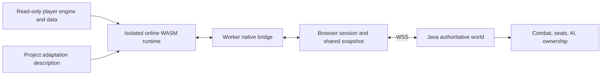

# Multiplayer architecture, builds, and maintenance

[English](multiplayer-development.md) | [简体中文](multiplayer-development.zh-CN.md)

The multiplayer implementation consists of **project-owned JavaScript, Java, Rust, and Python code working with a player-provided browser game engine**. The original `game.wasm` is not an engine written by this project. The online WASM is a launcher-generated adaptation of that original binary, stored outside the game folder.

The repository does not contain the original engine's C/C++ source or a toolchain that recompiles the complete engine from source. Project code and documentation use [MIT](../LICENSE); the original engine and game content are outside that grant. See [NOTICE](../NOTICE.md).

## 1. Where multiplayer logic lives

| Layer | Implementation | Responsibility |
| --- | --- | --- |
| Original game engine | Player-provided `b/8b0b5899ed/game.wasm` and matching engine JS/data | Rendering, native entities, animation, local input, and native simulation. These inputs remain read-only. |
| Engine adaptation tools | [`inspect_native_bridge.py`](../tools/inspect_native_bridge.py), [`build_native_probe.py`](../tools/build_native_probe.py) | Read symbols/types/instructions, check the supported binary, expose selected existing native functions, and insert bounded bridge hooks into an external runtime copy. |
| Engine-worker bridge | [`engine-bridge.js`](../client/multiplayer/engine-bridge.js), [`world-engine-bridge.js`](../client/multiplayer/world-engine-bridge.js) | Sample local intent/state and apply server-confirmed players, seats, entities, and effects through native commands. |
| Browser session and projection | [`public-session.js`](../client/multiplayer/public-session.js), [`game-adapter.js`](../client/multiplayer/game-adapter.js), [`world-state.js`](../client/multiplayer/world-state.js) | WSS connection, message validation, reconnect/snapshots, shared-memory projection, and worker communication. |
| Authoritative world server | [`Main.java`](../server/src/main/java/offline/multiplayer/Main.java), [`WorldService.java`](../server/src/main/java/offline/multiplayer/WorldService.java), [`WorldRegistry.java`](../server/src/main/java/offline/multiplayer/WorldRegistry.java) | Sessions, stable entity IDs, ownership leases, current seat occupancy, lifecycle, revisions, and accepted transactions. |
| World rules | `CombatWorld`, `WeaponPhysics`, `WorldAi`, `WorldLaw`, `WorldPopulation`, `WorldOwnership`, collision/navigation classes under [`server/src/main/java/offline/multiplayer/`](../server/src/main/java/offline/multiplayer/) | Combat decisions, AI objectives, law/population policy, simulation ownership, and supported server-side spatial queries. |
| Packaged launcher | [`engine.rs`](../desktop/src-tauri/src/engine.rs), [`lib.rs`](../desktop/src-tauri/src/lib.rs), [`http_server.rs`](../desktop/src-tauri/src/http_server.rs) | Read resources, build isolated runtimes from the embedded adaptation description, serve embedded client files/resources, and launch the browser. |
| Development resource server | [`serve_local.py`](../serve_local.py) | Python alternative to the launcher's local resource service; it is not the authoritative multiplayer server. |



The server decides shared outcomes. A leased client executes supported native movement/vehicle simulation and submits candidates; it does not become authoritative merely because it owns a native handle. Rendering and a substantial part of physical simulation still run in the browser engine. This is a custom protocol, not restored GTA Online networking or a complete headless RAGE server.

## 2. What the WASM adaptation changes

The Python reference builder currently appends exports for selected existing functions and adapts three checked function bodies:

1. A script-thread callback and conditional gate, placed after the active script context is installed. The bridge can sample/apply entities and suppress selected single-player script execution while preserving the original cleanup path.
2. A pause-menu frontend callback for native UI updates.
3. A single-player `SET_PLAYER_MODEL` wrapper adaptation, while keeping the direct model command available to the multiplayer bridge.

The surrounding JavaScript implements the multiplayer behavior. Adding an export exposes an existing native function; it does not implement a new game-engine subsystem. Function indexes, names, argument/result types, instruction boundaries, and body fingerprints are version-specific. Do not substitute a native hash for a WASM function index or remove the version check.

Current supported original SHA-256:

```text
11ca8d2c04c5e843d18ff4aea4899d72c86973c6b031df334e67c446b2ae83e0
```

Current 0.2.15 online runtime SHA-256:

```text
24489ede2e5d031573aa9dc2504db7b1d69b0e6afcc9358657f6c2fc6b52d003
```

These identify engine bytes, not the whole client release. A JavaScript-only change can require a new launcher build without changing the online WASM hash. The offline runtime remains byte-identical to its original input.

## 3. Original implementation versus reverse engineering

**Both are involved, at different layers.** The protocol, world registry, synchronization bridge, ownership rules, launcher, and adaptation tools are project source code. The engine-facing adapter was developed through static analysis of the supplied WASM's names, types, function bodies, and calling context. That analysis establishes how to call existing engine behavior safely; it does not recover the complete original source tree.

Most feature work uses ordinary JavaScript/Java/Rust development. Additional engine analysis is needed when a feature requires a native command that is not exposed, a different calling convention/context, a new hook, or support for a different engine binary.

Python's role is tooling: analysis, binary transformation, data extraction, source-description generation, and build orchestration. Python does not run the packaged multiplayer frame loop. The EXE/App uses Rust to reproduce the checked adaptation from [`engine-spec.json`](../desktop/src-tauri/assets/engine-spec.json), so players do not need Python.

`build_native_probe.py` retains its historical probe name; the public runtime path uses it with `--entity-probe --public-client` as the checked reference adapter builder.

## 4. One interaction from input to shared result

Vehicle entry is a useful example:

1. `world-engine-bridge.js` observes the native enter-vehicle intent and resolves the local vehicle handle to a shared `entity_id`.
2. It chooses a seat from the server's seat table. An occupied player driver seat becomes an available passenger-seat request; native entry is cancelled until confirmation.
3. `game-adapter.js` forwards the worker intent to `public-session.js`, which sends a validated `interaction_request` over the page's own WSS session.
4. `WorldService` and `WorldRegistry` check the acting player, lifecycle, distance, and current occupancy, then commit the seat transaction atomically. A driver receives a simulation ownership offer; a passenger does not gain driving authority.
5. The server distributes the confirmed entity/attachment delta. Each client resolves shared IDs to its own handles and applies the exact confirmed seat.

`generation` distinguishes lifecycles, `revision` tracks confirmed changes, and `owner_epoch` invalidates an old simulation lease. A native handle is local to one engine instance and must never be used as another client's identity.

## 5. Decide what to change and rebuild

| Feature/change | Edit first | Engine analysis/adaptation? | Delivery |
| --- | --- | --- | --- |
| Seat selection, smoothing, replicated effects | Client bridges and their protocol projection | Usually no, if required natives are already exposed | Rebuild EXE/App because client source is embedded; source-hosted pages use the updated files. |
| Damage, cooldown, AI objectives, ownership policy | Java rules/service/registry | Usually no | Rebuild/deploy JAR; rebuild clients too if messages or client behavior change. |
| New native command | Audit tool, export map, worker bridge | Yes: verify actual symbol, ABI, behavior, and script context | Regenerate/check engine spec and rebuild clients. |
| New hook or new original engine version | Checked binary adapter, spec generator, Rust builder as necessary | Yes; audit the new binary before adding support | Regenerate deterministic outputs and rebuild affected clients. Never accept a new engine by changing only its hash. |
| Launcher UI, settings, local resource service | `desktop/src/` and/or Rust modules | No | Rebuild affected platform applications. |
| Server address, WSS path, announcements | Configuration endpoint | No | Update configuration; no client rebuild for supported fields. Changing the configuration-provider URL itself is a separate source change. |
| Collision/navigation data coverage | Extraction tools and server spatial-data classes | Data-format analysis as needed | Generate into separate `server/world-data/`, then deploy the required server/data changes. |
| Documentation | README/docs | No | Commit documentation; no binary rebuild. |

A new shared action normally needs an intent, server validation/commit, a replicated result, and client rendering. Update both serialization and validation when changing the protocol; keep snapshots, reconnect, deletion, and ownership transfer consistent.

The 0.2.15 vehicle fix demonstrates the split: free passenger selection and seat reconciliation were JavaScript changes; preserving a driver's pending offer when a passenger exits was a Java change. Preventing native automatic seat shuffling required checking the existing engine's config-flag commands and flag 184, adding their exports to the Python map, regenerating the spec, and using those commands from the bridge. Only that engine-facing portion needed additional binary analysis.

## 6. Build commands

Commands below run from the repository root unless stated otherwise. Resource inputs and all runtime/report outputs must be separate directories.

### Source-hosted browser runtime

```sh
python3 -B tools/build_multiplayer_client.py \
  --game-dir "/path/to/browser-game" \
  --runtime-dir "/path/to/launcher-cache/runtime"
python3 -B serve_local.py \
  --game-dir "/path/to/browser-game" \
  --runtime-dir "/path/to/launcher-cache/runtime" \
  --host 127.0.0.1 --port 8000
```

This generates offline/online WASM copies and checksum sidecars. It transforms an existing binary; it does not compile original C++ engine source. The browser subsequently compiles/instantiates that WASM for execution.

### After changing the native export map or bounded patches

```sh
python3 -B tools/inspect_native_bridge.py \
  --wasm "/path/to/browser-game/b/8b0b5899ed/game.wasm" \
  --output "archive/cache/native-bridge-evidence.json"
python3 -B tools/generate_launcher_engine_spec.py \
  --wasm "/path/to/browser-game/b/8b0b5899ed/game.wasm"
python3 -B tools/generate_launcher_engine_spec.py \
  --wasm "/path/to/browser-game/b/8b0b5899ed/game.wasm" --check
```

Commit the Python adapter and regenerated `engine-spec.json` together. The Rust builder checks original input/body fingerprints and the final output hash; Python and Rust output must match. If the spec format or transformation algorithm changes, update both implementations instead of editing the JSON as a workaround.

### Java server

```sh
python3 -B tools/build_multiplayer_server.py
java -jar server/multiplayer-server.jar --host 127.0.0.1 --port 8787
```

Python invokes `javac --release 17` and packages the classes. Java executes the world server. Follow the [deployment guide](../server/deploy/README.md) for TLS, service installation, backups, and JAR rollout.

### Packaged launcher

```sh
cd desktop
npm ci
# macOS Apple Silicon, on macOS
npm run desktop:build:mac
# Windows x64, on Windows
npm run tauri -- build --no-bundle
```

Tauri builds the Vite UI and Rust application. [`build.rs`](../desktop/src-tauri/build.rs) embeds the project client source, excludes `client/runtime/`, and does not embed the original game engine. With an unchanged committed spec, building the App/EXE does not need game resources or Python. Runtime preparation reads the player's engine after resource selection.

## 7. Maintain a reproducible release

Keep the original inputs read-only; check their hashes before and after any output-producing work. Use the output-protection helpers and independent temporary files/atomic publication. Keep original WASM/JS, game packages, extracted geometry, secrets, caches, and local verification files out of Git.

For each feature, inspect the actual affected layer, check input/message validation and lifecycle/ownership behavior, and run appropriate local checks. For engine changes, check the spec against the reference builder and compare offline/online runtime hashes. The launcher's `--verify-resources RESOURCE_DIR EXTERNAL_CACHE_DIR` command checks resource preparation and its embedded HTTP client without opening the game.

Record the exact client build commit, server build commit, platform versions, and final file hashes. Configuration/documentation commits can follow binary compilation; label them separately. Replacing a local JS file does not update an already packaged App/EXE. Publishing new binaries also does not update a running Java service or a separately hosted website.

For integration into another website, use the [website integration guide](website-integration.md). Detailed engine evidence remains in [引擎分析](引擎分析.md), [resource isolation](启动器资源隔离.md), and [world design](统一世界服务端设计.md).
