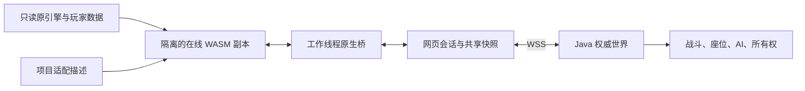

# 多人实现、构建与后续维护

[English](multiplayer-development.md) | [简体中文](multiplayer-development.zh-CN.md)

多人功能由**项目自有的 JavaScript、Java、Rust、Python 代码，配合玩家提供的浏览器游戏引擎**共同实现。原始 `game.wasm` 不是本项目自行编写的引擎；在线 WASM 是启动器依据适配规则，从原始二进制生成在游戏目录之外的运行副本。

仓库没有原引擎的 C/C++ 源码，也没有将完整原引擎从源码重新编译的工具链。项目自有代码和文档使用 [MIT](../LICENSE)，原引擎及游戏内容不在该授权内，详见 [NOTICE](../NOTICE.zh-CN.md)。

## 1. 多人逻辑分别在哪里

| 层次 | 实现位置 | 职责 |
| --- | --- | --- |
| 原游戏引擎 | 玩家提供的 `b/8b0b5899ed/game.wasm`、配套引擎 JS 与 data | 渲染、原生实体、动画、本地输入及原生模拟。原始输入只读。 |
| 引擎适配工具 | [`inspect_native_bridge.py`](../tools/inspect_native_bridge.py)、[`build_native_probe.py`](../tools/build_native_probe.py) | 解析名称、类型、指令，检查受支持二进制，导出选定的已有原生函数，在外部运行副本插入有限桥接钩子。 |
| 引擎工作线程桥 | [`engine-bridge.js`](../client/multiplayer/engine-bridge.js)、[`world-engine-bridge.js`](../client/multiplayer/world-engine-bridge.js) | 采样本地意图/状态，通过原生命令应用服务端确认的玩家、座位、实体和效果。 |
| 网页会话与状态投影 | [`public-session.js`](../client/multiplayer/public-session.js)、[`game-adapter.js`](../client/multiplayer/game-adapter.js)、[`world-state.js`](../client/multiplayer/world-state.js) | WSS、消息校验、重连/快照、共享内存投影与工作线程通信。 |
| 权威世界服务端 | [`Main.java`](../server/src/main/java/offline/multiplayer/Main.java)、[`WorldService.java`](../server/src/main/java/offline/multiplayer/WorldService.java)、[`WorldRegistry.java`](../server/src/main/java/offline/multiplayer/WorldRegistry.java) | 会话、稳定实体 ID、所有权租约、当前座位、生命周期、版本与确认事务。 |
| 世界规则 | [`server/src/main/java/offline/multiplayer/`](../server/src/main/java/offline/multiplayer/) 中的 `CombatWorld`、`WeaponPhysics`、`WorldAi`、`WorldLaw`、`WorldPopulation`、`WorldOwnership` 及碰撞/导航类 | 战斗判定、AI 目标、执法/人口策略、模拟者分配及已支持的服务端空间查询。 |
| 桌面启动器 | [`engine.rs`](../desktop/src-tauri/src/engine.rs)、[`lib.rs`](../desktop/src-tauri/src/lib.rs)、[`http_server.rs`](../desktop/src-tauri/src/http_server.rs) | 读取资源，按内置适配描述生成隔离副本，提供内嵌网页/资源服务并打开浏览器。 |
| 开发资源服务 | [`serve_local.py`](../serve_local.py) | 桌面本地资源服务的 Python 替代入口，不是权威多人游戏服务器。 |



服务端裁决共同结果；获租约的客户端执行已支持的原生移动/车辆模拟并提交候选状态，不能仅凭本机句柄取得权威。渲染和相当一部分物理模拟仍在浏览器引擎中运行。本项目使用自有协议，没有恢复原 GTA Online 网络，也不是完整的无图形 RAGE 服务端。

## 2. WASM 适配实际做了什么

Python 参考构建器目前追加选定的已有函数导出，并适配三个经过校验的函数体：

1. 在活动脚本上下文安装之后插入线程回调和条件门控，供桥接采样/应用实体，并在保留原清理路径的前提下抑制选定的单机脚本执行。
2. 在暂停菜单前端插入回调，更新原生界面。
3. 适配单机 `SET_PLAYER_MODEL` 包装器，同时保留多人桥直接调用角色模型命令的能力。

具体多人行为在外围 JS 中实现。增加导出是在开放已有原生函数，不是在实现一个新的引擎子系统。函数索引、名称、参数/返回类型、指令边界和函数体指纹均与版本绑定；不能把 native 哈希当成 WASM 函数索引，也不能移除版本校验。

当前支持的原始引擎 SHA-256：

```text
11ca8d2c04c5e843d18ff4aea4899d72c86973c6b031df334e67c446b2ae83e0
```

当前 0.2.15 在线副本 SHA-256：

```text
24489ede2e5d031573aa9dc2504db7b1d69b0e6afcc9358657f6c2fc6b52d003
```

它们标识引擎字节，不代表整个客户端版本。只改 JS 时，在线 WASM 哈希可能不变，但内嵌 JS 的启动器仍要重建。离线副本始终与原始输入字节一致。

## 3. 自己写的代码和逆向分析是什么关系

**两者都有，但作用不同。** 网络协议、世界注册表、同步桥、所有权规则、启动器和适配工具都是本项目源码。引擎接口适配建立在对已有 WASM 名称、类型、函数体及调用上下文的静态逆向分析上，用于确认如何调用原引擎能力；这不等于恢复完整原引擎源码。

日常功能维护主要是普通 JS、Java、Rust 开发。只有需要新增未导出的原生命令、改变调用约定/上下文、增加钩子或支持不同引擎二进制时，才需要继续做引擎分析。

Python 是工具层：分析、二进制转换、数据提取、适配描述生成和构建调度。它不在已打包客户端的多人帧循环中运行。EXE/App 通过 Rust 读取 [`engine-spec.json`](../desktop/src-tauri/assets/engine-spec.json)，自动重现经过校验的适配，因此玩家不需要 Python。

`build_native_probe.py` 沿用历史探针名称，公共运行副本使用 `--entity-probe --public-client`，它在这条流程中承担经过校验的参考适配构建器职责。

## 4. 一次交互怎样同步到所有人

以载具上车为例：

1. `world-engine-bridge.js` 发现原生上车意图，将本机车辆句柄映射为共同的 `entity_id`。
2. 根据服务端座位表选位。驾驶位已由其他玩家占用时改为申请空乘客位，确认前取消本机原生入车任务。
3. `game-adapter.js` 将工作线程意图交给 `public-session.js`，通过本页独立 WSS 会话发送已校验的 `interaction_request`。
4. `WorldService`、`WorldRegistry` 检查发起玩家、生命周期、距离和当前占位，原子提交座位事务。司机获得车辆模拟授权邀请，乘客不会获得驾驶权。
5. 服务端分发确认后的实体/挂接增量，每个客户端自行将共同 ID 映射成本机句柄，并应用确认座位。

`generation` 区分生命周期，`revision` 跟踪确认变更，`owner_epoch` 使旧模拟租约失效。原生句柄只在一个引擎实例内有效，不能用作另一客户端的实体身份。

## 5. 加功能时改哪里、重建什么

| 功能/改动 | 优先修改 | 是否需要引擎分析/适配 | 交付方式 |
| --- | --- | --- | --- |
| 座位选择、插值、同步表现 | 客户端桥和协议投影 | 已有所需 native 时通常不用 | EXE/App 内嵌客户端源码，必须重建；源码部署网页更新对应文件。 |
| 伤害、冷却、AI 目标、所有权策略 | Java 规则、服务和注册表 | 通常不用 | 重建并部署 JAR；消息或客户端行为改变时同步重建客户端。 |
| 新原生命令 | 审计工具、导出表和工作线程桥 | 需要：核对真实名称、ABI、行为和脚本上下文 | 重新生成/检查引擎描述，重建客户端。 |
| 新钩子或新的原始引擎版本 | 二进制适配器、描述生成器，必要时 Rust 构建器 | 需要先审计新二进制 | 生成确定性结果并重建客户端，不能只改输入哈希来接受新版本。 |
| 启动器界面、设置、本地资源服务 | `desktop/src/` 和/或 Rust 模块 | 不用 | 重建对应平台应用。 |
| 线路、WSS 路径、公告 | 配置接口 | 不用 | 更新已支持的配置字段不需重建；更换配置提供方 URL 属于另一项源码改动。 |
| 碰撞/导航覆盖 | 提取工具和服务端空间数据类 | 按需分析数据格式 | 输出到独立 `server/world-data/`，部署所需服务端/数据变更。 |
| 文档 | README/docs | 不用 | 提交文档，不需重建安装包。 |

新增共同动作通常需要完整实现“输入意图 → 服务端校验与事务 → 分发结果 → 客户端表现”。修改协议时要同时维护序列化与校验，并保持快照、重连、删除和所有权转移一致。

0.2.15 的同乘修复就是具体例子：空乘客位选择和座位纠正写在 JS；乘客离车保留司机待确认授权写在 Java。禁止原生自动换座则需要核对已有引擎的配置标志命令和 flag 184，在 Python 表中增加导出、重新生成描述，再由桥接调用。只有这个引擎接口部分需要追加二进制分析。

## 6. 构建步骤

以下命令默认在仓库根目录执行。资源输入与所有副本/报告输出必须放在不同目录。

### 源码方式部署浏览器运行副本

```sh
python3 -B tools/build_multiplayer_client.py \
  --game-dir "/path/to/browser-game" \
  --runtime-dir "/path/to/launcher-cache/runtime"
python3 -B serve_local.py \
  --game-dir "/path/to/browser-game" \
  --runtime-dir "/path/to/launcher-cache/runtime" \
  --host 127.0.0.1 --port 8000
```

这一步生成离线/在线 WASM 副本和校验记录，是对已有二进制作适配，不是编译原引擎 C++ 源码。随后浏览器才会编译/实例化这个 WASM 并执行。

### 导出表或有限补丁发生变化时

```sh
python3 -B tools/inspect_native_bridge.py \
  --wasm "/path/to/browser-game/b/8b0b5899ed/game.wasm" \
  --output "archive/cache/native-bridge-evidence.json"
python3 -B tools/generate_launcher_engine_spec.py \
  --wasm "/path/to/browser-game/b/8b0b5899ed/game.wasm"
python3 -B tools/generate_launcher_engine_spec.py \
  --wasm "/path/to/browser-game/b/8b0b5899ed/game.wasm" --check
```

Python 适配器与重新生成的 `engine-spec.json` 必须一起提交。Rust 构建器检查原始输入/函数体指纹和最终输出哈希，Python 与 Rust 的结果应一致。若描述格式或转换算法改变，两端都要维护，不能手改 JSON 绕过不匹配。

### Java 服务端

```sh
python3 -B tools/build_multiplayer_server.py
java -jar server/multiplayer-server.jar --host 127.0.0.1 --port 8787
```

Python 调用 `javac --release 17` 并打包 class，实际世界服务由 Java 执行。TLS、服务安装、备份与 JAR 更新见[部署说明](../server/deploy/README.md)。

### 打包启动器

```sh
cd desktop
npm ci
# macOS Apple Silicon：在 macOS 本机执行
npm run desktop:build:mac
# Windows x64：在 Windows 执行
npm run tauri -- build --no-bundle
```

Tauri 构建 Vite 界面与 Rust 应用。[`build.rs`](../desktop/src-tauri/build.rs) 嵌入项目客户端源码，排除 `client/runtime/`，不嵌入原游戏引擎。使用已提交且未变的适配描述构建 EXE/App，不需要游戏资源或 Python；选择资源后才在运行时读取玩家原引擎。

## 7. 后续维护与版本记录

保持原始输入只读，涉及输出的工作前后核对输入哈希。使用输出保护工具、独立临时文件与原子发布；原始 WASM/JS、游戏数据包、派生几何、凭据、缓存及本地回归文件均不能提交到 Git。

每个功能按实际影响检查输入/消息校验、生命周期和所有权行为，并执行适当的本地检查。引擎适配变更要与参考构建器核对，并比较离线/在线副本哈希。启动器的 `--verify-resources 资源目录 外部缓存目录` 可检查资源准备和内嵌客户端 HTTP 服务，不打开游戏。

发布记录区分客户端编译提交、服务端编译提交、平台版本和最终文件哈希。配置/文档可以在二进制构建后继续提交，要分别标注来源。修改本机 JS 不会自动更新已经打包的 EXE/App；发布客户端也不会自动更新运行中的 Java 服务或独立网站。

其他网站项目的接入方式见[网站集成指南](website-integration.zh-CN.md)。底层证据另见[引擎分析](引擎分析.md)、[资源隔离](启动器资源隔离.md)与[统一世界设计](统一世界服务端设计.md)。

GitHub 自动构建、更新说明 MD 和组件版本管理见[自动发布流程](releases.md#简体中文)。服务端部署沿该流程执行，网站配置更新仍单独明确处理。
